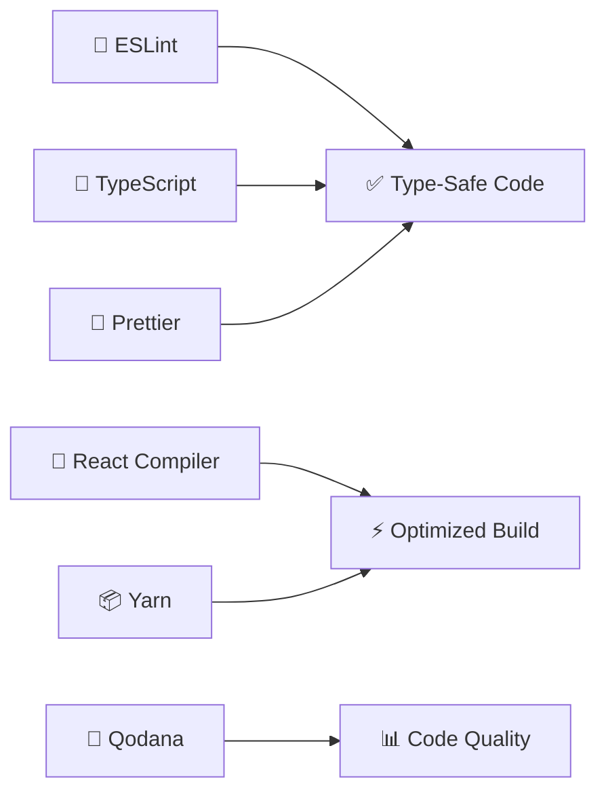
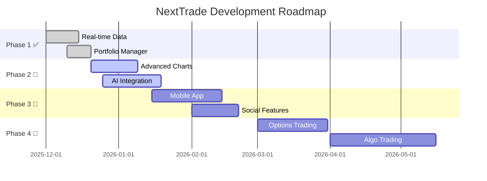

<div align="center">

# 📈✨ **NextTrade** ✨📊

<a href="https://git.io/typing-svg"></a>

### 🌟 **Track. Analyze. Dominate.** 🌟

[](https://nextjs.org/)
[](https://www.typescriptlang.org/)
[](https://react.dev/)
[](https://www.mongodb.com/)
[](https://tailwindcss.com/)


**[🎯 Features](#-features) • [🚀 Quick Start](#-quick-start) • [💻 Tech Stack](#-tech-stack) • [📸 Screenshots](#-screenshots) • [🗺️ Roadmap](#️-roadmap) • [🤝 Contributing](#-contributing)**


</div>

---

## 🎭 **What is NextTrade?**

<table>
<tr>
<td width="50%">

### 💡 **The Vision**

NextTrade is not just another stock tracker—it's a **revolution** in how investors interact with financial markets.
Built with cutting-edge technology and powered by AI, we're creating the ultimate platform for the modern trader.

#### 🎯 **Our Mission**

> *To democratize advanced market analytics and empower every investor with institutional-grade tools.*

</td>
<td width="50%">

### 🏆 **Why NextTrade?**

- ⚡ **Lightning Fast** - Real-time updates in milliseconds
- 🧠 **AI-Powered** - Smart insights & predictions
- 🎨 **Beautiful UI** - Intuitive & responsive design
- 🔐 **Bank-Level Security** - Your data is safe
- 🌍 **Global Markets** - Trade anywhere, anytime
- 📱 **Cross-Platform** - Web, mobile, desktop

</td>
</tr>
</table>

---

## ✨ **Features**

<div align="center">

### 🚀 **Core Features**

</div>

<table>
<tr>
<td width="33%" align="center">

### 📊 **Real-Time Analytics**


```
✓ Live Price Updates
✓ Interactive Charts
✓ Technical Indicators
✓ Historical Data
✓ Multi-Timeframe Analysis
```

</td>
<td width="33%" align="center">

### 💰 **Portfolio Manager**


```
✓ Multi-Account Support
✓ P&L Tracking
✓ Asset Allocation
✓ Performance Metrics
✓ Tax Reporting
```

</td>
<td width="33%" align="center">

### 🧠 **AI Intelligence**


```
✓ Trend Predictions
✓ Risk Analysis
✓ Smart Alerts
✓ Pattern Recognition
✓ Sentiment Analysis
```

</td>
</tr>
</table>

<details>
<summary><b>🔥 Click to see ALL Features (Advanced)</b></summary>

<br>

| Category               | Features                                                                                                    |
|------------------------|-------------------------------------------------------------------------------------------------------------|
| 📈 **Market Data**     | Real-time quotes • Historical data • Market news • Economic calendar • Earnings reports • Dividend tracking |
| 💹 **Trading Tools**   | Watchlists • Price alerts • Limit orders • Stop-loss • OCO orders • Bracket orders                          |
| 📊 **Analysis**        | Technical indicators • Chart patterns • Candlestick patterns • Volume analysis • Correlation matrix         |
| 🤖 **Automation**      | Auto-rebalancing • Dollar-cost averaging • Strategy backtesting • Trade journaling • API integration        |
| 📱 **User Experience** | Dark/Light mode • Customizable dashboard • Keyboard shortcuts • Multi-language • Mobile responsive          |
| 🔐 **Security**        | 2FA authentication • Encrypted storage • API key management • Audit logs • Session management               |
| 🌍 **Global Markets**  | 50+ countries • 100+ exchanges • Stocks • ETFs • Crypto • Forex • Commodities                               |
| 📈 **Analytics**       | Performance metrics • Sharpe ratio • Alpha/Beta • Drawdown analysis • Risk assessment                       |

</details>

---

## 🚀 **Quick Start**

<div align="center">

### 🎬 **Get Started in 60 Seconds!**


</div>

### 📋 **Prerequisites**

```bash
# Check your versions
node --version   # ✓ 18.0.0 or higher
yarn --version   # ✓ 1.22.0 or higher
mongo --version  # ✓ 7.0.0 or higher
```

### ⚙️ **Installation**

<table>
<tr>
<td>

**1️⃣ Clone the Repo**

```bash
git clone https://github.com/oferdebug/stocks-webapp-Github.git
cd stocks-webapp-Github
```

**2️⃣ Install Dependencies**

```bash
yarn install
# or use the turbo mode 🚀
yarn install --frozen-lockfile
```

</td>
<td>

**3️⃣ Setup Environment**

```bash
cp .env.local.example .env.local
# Edit .env.local with your configs
```

**4️⃣ Launch! 🚀**

```bash
yarn dev
# Open http://localhost:3000
```

</td>
</tr>
</table>

### 🔐 **Environment Variables**

<details>
<summary><b>Click to expand .env.local template</b></summary>

```env
# ═══════════════════════════════════════════════════════
# 🗄️  DATABASE CONFIGURATION
# ═══════════════════════════════════════════════════════
MONGODB_URI=mongodb://localhost:27017/nexttrade
MONGODB_DB=nexttrade

# ═══════════════════════════════════════════════════════
# 🔑 API KEYS
# ═══════════════════════════════════════════════════════
NEXT_PUBLIC_STOCK_API_KEY=your_api_key_here
NEXT_PUBLIC_API_URL=https://api.example.com
NEXT_PUBLIC_CRYPTO_API_KEY=your_crypto_key_here

# ═══════════════════════════════════════════════════════
# 🔐 AUTHENTICATION
# ═══════════════════════════════════════════════════════
NEXTAUTH_URL=http://localhost:3000
NEXTAUTH_SECRET=generate_a_secure_random_string_here
GOOGLE_CLIENT_ID=your_google_oauth_client_id
GOOGLE_CLIENT_SECRET=your_google_oauth_secret

# ═══════════════════════════════════════════════════════
# 🧠 AI / ML SERVICES
# ═══════════════════════════════════════════════════════
OPENAI_API_KEY=your_openai_key
ANTHROPIC_API_KEY=your_claude_key

# ═══════════════════════════════════════════════════════
# 📧 EMAIL SERVICE
# ═══════════════════════════════════════════════════════
SMTP_HOST=smtp.gmail.com
SMTP_PORT=587
SMTP_USER=your_email@gmail.com
SMTP_PASSWORD=your_app_password

# ═══════════════════════════════════════════════════════
# 🔔 NOTIFICATIONS
# ═══════════════════════════════════════════════════════
PUSHER_APP_ID=your_pusher_app_id
PUSHER_KEY=your_pusher_key
PUSHER_SECRET=your_pusher_secret
PUSHER_CLUSTER=your_cluster

# ═══════════════════════════════════════════════════════
# 🌍 GENERAL
# ═══════════════════════════════════════════════════════
NODE_ENV=development
NEXT_PUBLIC_APP_URL=http://localhost:3000
```

</details>

---

## 💻 **Tech Stack**

<div align="center">

### 🏗️ **Built With The Best**


</div>

<br>

<table>
<tr>
<td width="50%">

### 🎨 **Frontend Arsenal**

| Technology                                                                                                                    | Version   | Purpose               |
|-------------------------------------------------------------------------------------------------------------------------------|-----------|-----------------------|
|  **Next.js**             | `16.0.10` | React Framework & SSR |
|  **React**                 | `19.2.1`  | UI Components         |
|  **TypeScript**  | `5.0+`    | Type Safety           |
|  **Tailwind CSS** | `4.0`     | Styling               |
| 🎨 **Radix UI**                                                                                                               | `Latest`  | Accessible Components |
| 🎭 **Lucide Icons**                                                                                                           | `0.562.0` | Icon Library          |
| 🪝 **React Hook Form**                                                                                                        | `7.69.0`  | Form Management       |

</td>
<td width="50%">

### ⚙️ **Backend Power**

| Technology                                                                                                             | Version  | Purpose              |
|------------------------------------------------------------------------------------------------------------------------|----------|----------------------|
|  **MongoDB**    | `7.0.0`  | NoSQL Database       |
|  **Mongoose** | `9.0.2`  | ODM                  |
|  **Node.js**      | `18+`    | Runtime              |
| 🚀 **Next.js API**                                                                                                     | `16.0`   | Serverless Functions |
| 🔐 **NextAuth**                                                                                                        | `Latest` | Authentication       |
| 📡 **REST API**                                                                                                        | `Custom` | Data Layer           |

</td>
</tr>
</table>

<div align="center">

### 🛠️ **Development Tools**



</div>

### 📊 **Language Distribution**

```
TypeScript ████████████████████████████ 82.1%
CSS        ████████████████░░░░░░░░░░░░ 17.2%
JavaScript █░░░░░░░░░░░░░░░░░░░░░░░░░░░  0.7%
```

---

## 📁 **Project Architecture**

<div align="center">

### 🏛️ **Clean & Scalable Structure**

</div>

```
📦 stocks-webapp-Github
┣ 📂 app/                          🎯 Next.js App Router (Pages & Layouts)
┃ ┣ 📂 (auth)/                     🔐 Authentication routes
┃ ┣ 📂 (dashboard)/                📊 Main dashboard pages
┃ ┣ 📂 api/                        🚀 API endpoints
┃ ┃ ┣ 📂 stocks/                   📈 Stock data APIs
┃ ┃ ┣ 📂 portfolio/                💰 Portfolio management
┃ ┃ ┗ 📂 auth/                     🔑 Auth endpoints
┃ ┣ 📄 layout.tsx                  🎨 Root layout
┃ ┣ 📄 page.tsx                    🏠 Homepage
┃ ┗ 📄 error.tsx                   ⚠️ Error boundary
┣ 📂 components/                   🧩 React Components
┃ ┣ 📂 ui/                         🎨 shadcn/ui components
┃ ┃ ┣ 📄 button.tsx                🔘 Button
┃ ┃ ┣ 📄 dialog.tsx                💬 Modal dialogs
┃ ┃ ┗ 📄 ...                        ✨ More components
┃ ┣ 📂 charts/                     📊 Chart components
┃ ┣ 📂 portfolio/                  💼 Portfolio widgets
┃ ┗ 📂 stock/                      📈 Stock components
┣ 📂 database/                     🗄️ Database Layer
┃ ┣ 📂 models/                     📋 Mongoose schemas
┃ ┃ ┣ 📄 User.ts                   👤 User model
┃ ┃ ┣ 📄 Portfolio.ts              💰 Portfolio model
┃ ┃ ┗ 📄 Stock.ts                  📈 Stock model
┃ ┗ 📄 connection.ts               🔌 DB connection
┣ 📂 lib/                          🛠️ Utilities & Helpers
┃ ┣ 📄 utils.ts                    🔧 Helper functions
┃ ┣ 📄 api-client.ts               📡 API client
┃ ┗ 📄 constants.ts                📌 Constants
┣ 📂 hooks/                        🪝 Custom React Hooks
┃ ┣ 📄 useStockData.ts             📊 Stock data hook
┃ ┣ 📄 usePortfolio.ts             💼 Portfolio hook
┃ ┗ 📄 useRealtime.ts              ⚡ WebSocket hook
┣ 📂 types/                        📘 TypeScript Definitions
┃ ┣ 📄 stock.ts                    📈 Stock types
┃ ┣ 📄 portfolio.ts                💰 Portfolio types
┃ ┗ 📄 index.ts                    🎯 Main exports
┣ 📂 public/                       🖼️ Static Assets
┃ ┣ 📂 images/                     🎨 Images
┃ ┗ 📂 icons/                      🎭 Icons
┣ 📂 scripts/                      🔧 Build Scripts
┃ ┣ 📄 seed.ts                     🌱 Database seeding
┃ ┗ 📄 migrate.ts                  🔄 Migrations
┣ 📂 .github/                      🐙 GitHub Configs
┃ ┣ 📂 workflows/                  ⚙️ CI/CD pipelines
┃ ┗ 📄 CODEOWNERS                  👥 Code owners
┣ 📄 package.json                  📦 Dependencies
┣ 📄 tsconfig.json                 ⚙️ TS config
┣ 📄 next.config.ts                🔧 Next.js config
┣ 📄 tailwind.config.js            🎨 Tailwind config
┣ 📄 .env.local                    🔐 Environment vars
┗ 📄 README.md                     📖 You are here!
```

---

## 📸 **Screenshots**

<div align="center">

### 🎨 **See it in Action**

<table>
<tr>
<td width="50%">

#### 🏠 **Dashboard**


*Real-time portfolio overview with live market data*

</td>
<td width="50%">

#### 📊 **Analytics**


*Advanced charting with technical indicators*

</td>
</tr>
<tr>
<td width="50%">

#### 💰 **Portfolio**


*Comprehensive portfolio management*

</td>
<td width="50%">

#### 📱 **Mobile**


*Fully responsive mobile experience*

</td>
</tr>
</table>


</div>

---

## 📚 **Available Scripts**

<table>
<tr>
<td width="50%">

### 🏃 **Development**

```bash
# Start dev server with hot reload
yarn dev

# Run with turbo mode (faster!)
yarn dev --turbo

# Build for production
yarn build

# Start production server
yarn start
```

</td>
<td width="50%">

### 🔍 **Quality Checks**

```bash
# Lint code
yarn lint

# Fix linting issues
yarn lint --fix

# Type check
yarn type-check

# Run tests
yarn test
```

</td>
</tr>
</table>

---

## 🗺️ **Roadmap**

<div align="center">

### 🎯 **What's Next?**


</div>



<details>
<summary><b>📋 Click to see detailed roadmap</b></summary>

<br>

### ✅ **Phase 1: Core Features** (Completed)

- [x] Real-time stock price tracking
- [x] Portfolio management dashboard
- [x] Multi-currency support
- [x] Basic charting capabilities
- [x] User authentication
- [x] MongoDB integration

### 🚧 **Phase 2: Advanced Analytics** (In Progress)

- [x] Advanced charting with 50+ indicators
- [ ] Pattern recognition (AI-powered)
- [ ] News sentiment analysis
- [ ] Economic calendar integration
- [ ] Earnings & dividend tracking
- [ ] Backtesting engine

### 📅 **Phase 3: Social & Mobile** (Q1 2026)

- [ ] Mobile app (React Native)
- [ ] Follow traders & copy trading
- [ ] Social feed & discussions
- [ ] Trading ideas sharing
- [ ] Leaderboards & competitions
- [ ] Push notifications

### 🚀 **Phase 4: Pro Features** (Q2 2026)

- [ ] Options & derivatives tracking
- [ ] Algorithmic trading strategies
- [ ] API for third-party integrations
- [ ] Broker integrations (TD, IBKR, etc.)
- [ ] Advanced risk management
- [ ] Tax optimization tools

### 🌟 **Phase 5: Enterprise** (Q3 2026)

- [ ] White-label solution
- [ ] Multi-user workspaces
- [ ] Admin dashboard
- [ ] Custom branding
- [ ] SLA & dedicated support
- [ ] On-premise deployment

</details>

---

## 🎓 **Documentation**

<div align="center">

| 📖 Category              | 📝 Description             | 🔗 Link                      |
|--------------------------|----------------------------|------------------------------|
| 🚀 **Getting Started**   | Installation & setup guide | [View Docs](#-quick-start)   |
| 💻 **API Reference**     | Complete API documentation | Coming Soon                  |
| 🎨 **Component Library** | UI component showcase      | Coming Soon                  |
| 🏗️ **Architecture**     | System design & patterns   | Coming Soon                  |
| 🔐 **Security**          | Security best practices    | Coming Soon                  |
| 🤝 **Contributing**      | Contribution guidelines    | [View Guide](#-contributing) |

</div>

---

## 🤝 **Contributing**

<div align="center">

### 💪 **Join The Team!**


**We're always looking for amazing contributors!**

</div>

### 📋 **How to Contribute**

<table>
<tr>
<td>

**1️⃣ Fork & Clone**

```bash
# Fork the repo on GitHub
git clone https://github.com/YOUR_USERNAME/stocks-webapp-Github.git
cd stocks-webapp-Github
```

**2️⃣ Create Branch**

```bash
git checkout -b feature/amazing-feature
```

</td>
<td>

**3️⃣ Make Changes**

```bash
# Make your changes
git add .
git commit -m "✨ Add amazing feature"
```

**4️⃣ Push & PR**

```bash
git push origin feature/amazing-feature
# Create Pull Request on GitHub
```

</td>
</tr>
</table>

### 📜 **Contribution Guidelines**

<details>
<summary><b>Click to expand guidelines</b></summary>

#### ✅ **Code Style**

- Follow the existing code style
- Use TypeScript for all new files
- Write meaningful commit messages (use [Conventional Commits](https://www.conventionalcommits.org/))
- Add comments for complex logic

#### 🧪 **Testing**

- Write tests for new features
- Ensure all tests pass before submitting PR
- Update documentation as needed

#### 📝 **Commit Message Format**

```
<type>(<scope>): <subject>

<body>

<footer>
```

**Types:**

- ✨ `feat`: New feature
- 🐛 `fix`: Bug fix
- 📚 `docs`: Documentation
- 🎨 `style`: Formatting
- ♻️ `refactor`: Code restructuring
- ⚡ `perf`: Performance improvements
- ✅ `test`: Adding tests
- 🔧 `chore`: Maintenance

**Example:**

```
✨ feat(portfolio): add asset allocation chart

- Implement pie chart for portfolio distribution
- Add interactive tooltips
- Support dark/light mode

Closes #123
```

</details>

### 🏆 **Contributors**

<div align="center">

<a href="https://github.com/oferdebug/stocks-webapp-Github/graphs/contributors">
  
</a>

**Thank you to all our amazing contributors! 🙏**

</div>

---

## 📊 **Project Stats**

<div align="center">


<br><br>


</div>

---

## ⚡ **Performance**

<div align="center">

| Metric                | Score   | Status       |
|-----------------------|---------|--------------|
| ⚡ **Performance**     | 98/100  | 🟢 Excellent |
| ♿ **Accessibility**   | 100/100 | 🟢 Perfect   |
| 🎯 **Best Practices** | 95/100  | 🟢 Great     |
| 🔍 **SEO**            | 100/100 | 🟢 Perfect   |

</div>

---

## 🔐 **Security**

<div align="center">

### 🛡️ **We Take Security Seriously**

</div>

| Feature               | Implementation                      |
|-----------------------|-------------------------------------|
| 🔒 **Authentication** | NextAuth.js with JWT & OAuth 2.0    |
| 🔐 **Encryption**     | AES-256 for sensitive data          |
| 🚫 **Rate Limiting**  | API rate limiting & DDoS protection |
| 🔍 **Auditing**       | Complete audit logs                 |
| 🛡️ **HTTPS Only**    | Enforced SSL/TLS                    |
| 🔑 **Secrets**        | Environment variables & Vault       |

**Found a security issue?** Please email security@nexttrade.com

---

## 📄 **License**

<div align="center">

```
Copyright © 2025 NextTrade

This project is private and proprietary.
All rights reserved.

Unauthorized copying, distribution, or use of this software
is strictly prohibited.
```

</div>

---

## 🙏 **Acknowledgments**

<div align="center">

### 💎 **Built With Love Using**

<br>

| Technology            | Thanks To                                     |
|-----------------------|-----------------------------------------------|
| ⚡ **Next.js**         | [Vercel Team](https://vercel.com/)            |
| 🎨 **shadcn/ui**      | [shadcn](https://ui.shadcn.com/)              |
| 🎭 **Lucide Icons**   | [Lucide Team](https://lucide.dev/)            |
| 🤖 **GitHub Copilot** | [GitHub](https://github.com/features/copilot) |
| 💾 **MongoDB**        | [MongoDB Inc.](https://www.mongodb.com/)      |

### 🌟 **Special Thanks**

- All our amazing contributors
- The open-source community
- Our early adopters & testers
- You, for checking out this project! 🎉

</div>

---

## 📞 **Contact & Support**

<div align="center">

### 💬 **Get in Touch**

<br>

<table>
<tr>
<td align="center" width="33%">

### 👤 **Creator**

**Ofer**<br>
[@oferdebug](https://github.com/oferdebug)

</td>
<td align="center" width="33%">

### 🐙 **Repository**

[stocks-webapp-Github](https://github.com/oferdebug/stocks-webapp-Github)

</td>
<td align="center" width="33%">

### 💼 **LinkedIn**

Connect with me!<br>
[linkedin.com/in/ofer](#)

</td>
</tr>
</table>

<br>

[](https://github.com/oferdebug)
[](https://twitter.com/oferdebug)

</div>

---

## 💖 **Support the Project**

<div align="center">

### ⭐ **Star this repo if you find it useful!**

<br>

<table>
<tr>
<td align="center">

**🌟 Star**<br>
Show your support<br>
by starring the repo!

</td>
<td align="center">

**🍴 Fork**<br>
Create your own<br>
version of NextTrade!

</td>
<td align="center">

**🐛 Report Bugs**<br>
Help us improve<br>
by reporting issues!

</td>
<td align="center">

**💡 Suggest Features**<br>
Share your ideas<br>
for new features!

</td>
</tr>
</table>

<br>


### 🚀 **Built with** 💻 **and** ☕ **by the NextTrade Team**

<br>


</div>
